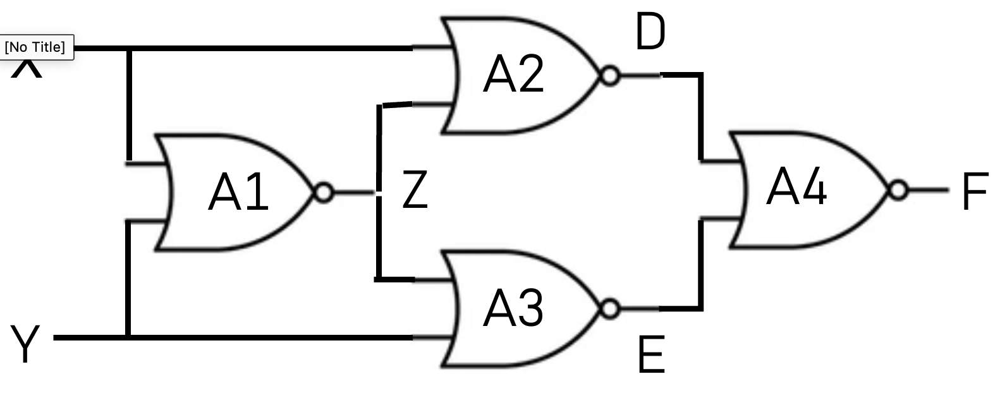
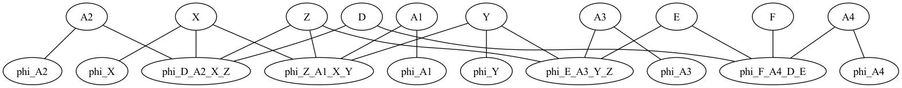

# Chapter 6
## Belief Propagation with Join Trees

First we import pgmpy libraries


```python
from pgmpy.models import BayesianNetwork, MarkovNetwork
from pgmpy.inference import BeliefPropagation
from pgmpy.factors.discrete import TabularCPD
from pgmpy.factors.discrete import DiscreteFactor
from pgmpy.base import DAG
from contextlib import redirect_stdout
from pgmpy.models import JunctionTree
import warnings

warnings.filterwarnings('ignore', category=DeprecationWarning)

warnings.filterwarnings('ignore', category=np.DeprecationWarning)  # It will ignore all numpy deprecation warnings

```


    ---------------------------------------------------------------------------

    NameError                                 Traceback (most recent call last)

    Cell In[1], line 12
          8 import warnings
         10 warnings.filterwarnings('ignore', category=DeprecationWarning)
    ---> 12 warnings.filterwarnings('ignore', category=np.DeprecationWarning)  # It will ignore all numpy deprecation warnings


    NameError: name 'np' is not defined


## Circuit diagnosis Bayesian Network

#### Create the BN model and specify its structure
The following code creates the circuit diagnosis BN model. The model factors according to a  DAG having 10 nodes and 12 edges. 
 
The nodes are the following network variables.  
A1 A3 Y  A2 X  Z  E  D  A4 F
The following variables represent hypotheses about the working condition of the four NOR gates of the circuit.  
A1 A2 A3 A4
All network variables are binary taking values 0 and 1.  

The directed edges of the DAG are as follows:  
A1->Z A3->E Y ->Z Y ->E A2->D X ->Z X ->D Z ->E Z ->D E ->F D ->F A4->F   


```python
def circuit():
    circuit: BayesianNetwork = BayesianNetwork()
    circuit.add_nodes_from(["X", "Y", "Z", "D", "E", "F", "A1", "A2", "A3", "A4"])
    circuit.add_edge("X", "Z")
    circuit.add_edge("Y", "Z")
    circuit.add_edge("A1", "Z")
    circuit.add_edge("X", "D")
    circuit.add_edge("Z", "D")
    circuit.add_edge("A2", "D")
    circuit.add_edge("Z", "E")
    circuit.add_edge("Y", "E")
    circuit.add_edge("A3", "E")
    circuit.add_edge("D", "F")
    circuit.add_edge("A4", "F")
    circuit.add_edge("E", "F")
    return circuit

```

#### Create the Qualitative Component
The following code creates the graph object to represent the BN structure having the nodes and edges specified for the BN model.


```python
def circuit_dag():
    model = circuit()
    G = DAG()
    nodes = model.nodes
    edges = model.edges
    G.add_nodes_from(nodes)
    G.add_edges_from(edges)
    return G

print(f"creating the directed acyclic graph for the circuit diagnosis example")
G = circuit_dag()
print(G)
```

    creating the directed acyclic graph for the circuit diagnosis example


#### Create the Quantitative Component
The following code specifies the condition probability distributions for all the network variables and add the CPDs to the model. After quantifying the BN model for the circuit diagnosis example we check the model if it is specifying correctly. The function check_model() should return True if the checking is successful.


```python

model = circuit()
cpd_X = TabularCPD(variable="X", variable_card=2, values=[[0.5], [0.5]])
cpd_Y = TabularCPD(variable="Y", variable_card=2, values=[[0.5], [0.5]])
cpd_A1 = TabularCPD(variable="A1", variable_card=2, values=[[0.95], [0.05]])
cpd_A2 = TabularCPD(variable="A2", variable_card=2, values=[[0.95], [0.05]])
cpd_A3 = TabularCPD(variable="A3", variable_card=2, values=[[0.95], [0.05]])
cpd_A4 = TabularCPD(variable="A4", variable_card=2, values=[[0.95], [0.05]])
cpd_Z = TabularCPD(
    variable="Z",
    variable_card=2,
    values=[
        [1e-9, 1 - 1e-9, 1 - 1e-9, 1 - 1e-9, 0.5, 0.5, 0.5, 0.5],
        [1 - 1e-9, 1e-9, 1e-9, 1e-9, 0.5, 0.5, 0.5, 0.5],
    ],
    evidence=["A1", "X", "Y"],
    evidence_card=[2, 2, 2],
)
cpd_D = TabularCPD(
    variable="D",
    variable_card=2,
    values=[
        [1e-9, 1 - 1e-9, 1 - 1e-9, 1 - 1e-9, 0.5, 0.5, 0.5, 0.5],
        [1 - 1e-9, 1e-9, 1e-9, 1e-9, 0.5, 0.5, 0.5, 0.5],
    ],
    evidence=["A2", "X", "Z"],
    evidence_card=[2, 2, 2],
)
cpd_E = TabularCPD(
    variable="E",
    variable_card=2,
    values=[
        [1e-9, 1 - 1e-9, 1 - 1e-9, 1 - 1e-9, 0.5, 0.5, 0.5, 0.5],
        [1 - 1e-9, 1e-9, 1e-9, 1e-9, 0.5, 0.5, 0.5, 0.5],
    ],
    evidence=["A3", "Y", "Z"],
    evidence_card=[2, 2, 2],
)
cpd_F = TabularCPD(
    variable="F",
    variable_card=2,
    values=[
        [1e-9, 1 - 1e-9, 1 - 1e-9, 1 - 1e-9, 0.5, 0.5, 0.5, 0.5],
        [1 - 1e-9, 1e-9, 1e-9, 1e-9, 0.5, 0.5, 0.5, 0.5],
    ],
    evidence=["A4", "D", "E"],
    evidence_card=[2, 2, 2],
)

model.add_cpds(cpd_X, cpd_Y, cpd_Z, cpd_D, cpd_E, cpd_F, cpd_A1, cpd_A2, cpd_A3, cpd_A4, cpd_F)

print(model.check_model())
```

    True


```python
markovmodel = model.to_markov_model()
factors = markovmodel.get_factors()
for factor in factors:
    print(factor)
```

    +------+----------+
    | X    |   phi(X) |
    +======+==========+
    | X(0) |   0.5000 |
    +------+----------+
    | X(1) |   0.5000 |
    +------+----------+
    +------+----------+
    | Y    |   phi(Y) |
    +======+==========+
    | Y(0) |   0.5000 |
    +------+----------+
    | Y(1) |   0.5000 |
    +------+----------+
    +------+-------+------+------+-----------------+
    | Z    | A1    | X    | Y    |   phi(Z,A1,X,Y) |
    +======+=======+======+======+=================+
    | Z(0) | A1(0) | X(0) | Y(0) |          0.0000 |
    +------+-------+------+------+-----------------+
    | Z(0) | A1(0) | X(0) | Y(1) |          1.0000 |
    +------+-------+------+------+-----------------+
    | Z(0) | A1(0) | X(1) | Y(0) |          1.0000 |
    +------+-------+------+------+-----------------+
    | Z(0) | A1(0) | X(1) | Y(1) |          1.0000 |
    +------+-------+------+------+-----------------+
    | Z(0) | A1(1) | X(0) | Y(0) |          0.5000 |
    +------+-------+------+------+-----------------+
    | Z(0) | A1(1) | X(0) | Y(1) |          0.5000 |
    +------+-------+------+------+-----------------+
    | Z(0) | A1(1) | X(1) | Y(0) |          0.5000 |
    +------+-------+------+------+-----------------+
    | Z(0) | A1(1) | X(1) | Y(1) |          0.5000 |
    +------+-------+------+------+-----------------+
    | Z(1) | A1(0) | X(0) | Y(0) |          1.0000 |
    +------+-------+------+------+-----------------+
    | Z(1) | A1(0) | X(0) | Y(1) |          0.0000 |
    +------+-------+------+------+-----------------+
    | Z(1) | A1(0) | X(1) | Y(0) |          0.0000 |
    +------+-------+------+------+-----------------+
    | Z(1) | A1(0) | X(1) | Y(1) |          0.0000 |
    +------+-------+------+------+-----------------+
    | Z(1) | A1(1) | X(0) | Y(0) |          0.5000 |
    +------+-------+------+------+-----------------+
    | Z(1) | A1(1) | X(0) | Y(1) |          0.5000 |
    +------+-------+------+------+-----------------+
    | Z(1) | A1(1) | X(1) | Y(0) |          0.5000 |
    +------+-------+------+------+-----------------+
    | Z(1) | A1(1) | X(1) | Y(1) |          0.5000 |
    +------+-------+------+------+-----------------+
    +------+-------+------+------+-----------------+
    | D    | A2    | X    | Z    |   phi(D,A2,X,Z) |
    +======+=======+======+======+=================+
    | D(0) | A2(0) | X(0) | Z(0) |          0.0000 |
    +------+-------+------+------+-----------------+
    | D(0) | A2(0) | X(0) | Z(1) |          1.0000 |
    +------+-------+------+------+-----------------+
    | D(0) | A2(0) | X(1) | Z(0) |          1.0000 |
    +------+-------+------+------+-----------------+
    | D(0) | A2(0) | X(1) | Z(1) |          1.0000 |
    +------+-------+------+------+-----------------+
    | D(0) | A2(1) | X(0) | Z(0) |          0.5000 |
    +------+-------+------+------+-----------------+
    | D(0) | A2(1) | X(0) | Z(1) |          0.5000 |
    +------+-------+------+------+-----------------+
    | D(0) | A2(1) | X(1) | Z(0) |          0.5000 |
    +------+-------+------+------+-----------------+
    | D(0) | A2(1) | X(1) | Z(1) |          0.5000 |
    +------+-------+------+------+-----------------+
    | D(1) | A2(0) | X(0) | Z(0) |          1.0000 |
    +------+-------+------+------+-----------------+
    | D(1) | A2(0) | X(0) | Z(1) |          0.0000 |
    +------+-------+------+------+-----------------+
    | D(1) | A2(0) | X(1) | Z(0) |          0.0000 |
    +------+-------+------+------+-----------------+
    | D(1) | A2(0) | X(1) | Z(1) |          0.0000 |
    +------+-------+------+------+-----------------+
    | D(1) | A2(1) | X(0) | Z(0) |          0.5000 |
    +------+-------+------+------+-----------------+
    | D(1) | A2(1) | X(0) | Z(1) |          0.5000 |
    +------+-------+------+------+-----------------+
    | D(1) | A2(1) | X(1) | Z(0) |          0.5000 |
    +------+-------+------+------+-----------------+
    | D(1) | A2(1) | X(1) | Z(1) |          0.5000 |
    +------+-------+------+------+-----------------+
    +------+-------+------+------+-----------------+
    | E    | A3    | Y    | Z    |   phi(E,A3,Y,Z) |
    +======+=======+======+======+=================+
    | E(0) | A3(0) | Y(0) | Z(0) |          0.0000 |
    +------+-------+------+------+-----------------+
    | E(0) | A3(0) | Y(0) | Z(1) |          1.0000 |
    +------+-------+------+------+-----------------+
    | E(0) | A3(0) | Y(1) | Z(0) |          1.0000 |
    +------+-------+------+------+-----------------+
    | E(0) | A3(0) | Y(1) | Z(1) |          1.0000 |
    +------+-------+------+------+-----------------+
    | E(0) | A3(1) | Y(0) | Z(0) |          0.5000 |
    +------+-------+------+------+-----------------+
    | E(0) | A3(1) | Y(0) | Z(1) |          0.5000 |
    +------+-------+------+------+-----------------+
    | E(0) | A3(1) | Y(1) | Z(0) |          0.5000 |
    +------+-------+------+------+-----------------+
    | E(0) | A3(1) | Y(1) | Z(1) |          0.5000 |
    +------+-------+------+------+-----------------+
    | E(1) | A3(0) | Y(0) | Z(0) |          1.0000 |
    +------+-------+------+------+-----------------+
    | E(1) | A3(0) | Y(0) | Z(1) |          0.0000 |
    +------+-------+------+------+-----------------+
    | E(1) | A3(0) | Y(1) | Z(0) |          0.0000 |
    +------+-------+------+------+-----------------+
    | E(1) | A3(0) | Y(1) | Z(1) |          0.0000 |
    +------+-------+------+------+-----------------+
    | E(1) | A3(1) | Y(0) | Z(0) |          0.5000 |
    +------+-------+------+------+-----------------+
    | E(1) | A3(1) | Y(0) | Z(1) |          0.5000 |
    +------+-------+------+------+-----------------+
    | E(1) | A3(1) | Y(1) | Z(0) |          0.5000 |
    +------+-------+------+------+-----------------+
    | E(1) | A3(1) | Y(1) | Z(1) |          0.5000 |
    +------+-------+------+------+-----------------+
    +------+-------+------+------+-----------------+
    | F    | A4    | D    | E    |   phi(F,A4,D,E) |
    +======+=======+======+======+=================+
    | F(0) | A4(0) | D(0) | E(0) |          0.0000 |
    +------+-------+------+------+-----------------+
    | F(0) | A4(0) | D(0) | E(1) |          1.0000 |
    +------+-------+------+------+-----------------+
    | F(0) | A4(0) | D(1) | E(0) |          1.0000 |
    +------+-------+------+------+-----------------+
    | F(0) | A4(0) | D(1) | E(1) |          1.0000 |
    +------+-------+------+------+-----------------+
    | F(0) | A4(1) | D(0) | E(0) |          0.5000 |
    +------+-------+------+------+-----------------+
    | F(0) | A4(1) | D(0) | E(1) |          0.5000 |
    +------+-------+------+------+-----------------+
    | F(0) | A4(1) | D(1) | E(0) |          0.5000 |
    +------+-------+------+------+-----------------+
    | F(0) | A4(1) | D(1) | E(1) |          0.5000 |
    +------+-------+------+------+-----------------+
    | F(1) | A4(0) | D(0) | E(0) |          1.0000 |
    +------+-------+------+------+-----------------+
    | F(1) | A4(0) | D(0) | E(1) |          0.0000 |
    +------+-------+------+------+-----------------+
    | F(1) | A4(0) | D(1) | E(0) |          0.0000 |
    +------+-------+------+------+-----------------+
    | F(1) | A4(0) | D(1) | E(1) |          0.0000 |
    +------+-------+------+------+-----------------+
    | F(1) | A4(1) | D(0) | E(0) |          0.5000 |
    +------+-------+------+------+-----------------+
    | F(1) | A4(1) | D(0) | E(1) |          0.5000 |
    +------+-------+------+------+-----------------+
    | F(1) | A4(1) | D(1) | E(0) |          0.5000 |
    +------+-------+------+------+-----------------+
    | F(1) | A4(1) | D(1) | E(1) |          0.5000 |
    +------+-------+------+------+-----------------+
    +-------+-----------+
    | A1    |   phi(A1) |
    +=======+===========+
    | A1(0) |    0.9500 |
    +-------+-----------+
    | A1(1) |    0.0500 |
    +-------+-----------+
    +-------+-----------+
    | A2    |   phi(A2) |
    +=======+===========+
    | A2(0) |    0.9500 |
    +-------+-----------+
    | A2(1) |    0.0500 |
    +-------+-----------+
    +-------+-----------+
    | A3    |   phi(A3) |
    +=======+===========+
    | A3(0) |    0.9500 |
    +-------+-----------+
    | A3(1) |    0.0500 |
    +-------+-----------+
    +-------+-----------+
    | A4    |   phi(A4) |
    +=======+===========+
    | A4(0) |    0.9500 |
    +-------+-----------+
    | A4(1) |    0.0500 |
    +-------+-----------+


```python
markovmodel.check_model()
```


    True


```python
markovmodel.get_partition_function()
```


    1.0000000000000002


```python
factor_graph = markovmodel.to_factor_graph()
print(factor_graph.nodes)
print(factor_graph.edges)
```

    ['X', 'Z', 'D', 'Y', 'A1', 'A2', 'E', 'A3', 'F', 'A4', 'phi_X', 'phi_Y', 'phi_Z_A1_X_Y', 'phi_D_A2_X_Z', 'phi_E_A3_Y_Z', 'phi_F_A4_D_E', 'phi_A1', 'phi_A2', 'phi_A3', 'phi_A4']
    [('X', 'phi_X'), ('X', 'phi_Z_A1_X_Y'), ('X', 'phi_D_A2_X_Z'), ('Z', 'phi_Z_A1_X_Y'), ('Z', 'phi_D_A2_X_Z'), ('Z', 'phi_E_A3_Y_Z'), ('D', 'phi_D_A2_X_Z'), ('D', 'phi_F_A4_D_E'), ('Y', 'phi_Y'), ('Y', 'phi_Z_A1_X_Y'), ('Y', 'phi_E_A3_Y_Z'), ('A1', 'phi_Z_A1_X_Y'), ('A1', 'phi_A1'), ('A2', 'phi_D_A2_X_Z'), ('A2', 'phi_A2'), ('E', 'phi_E_A3_Y_Z'), ('E', 'phi_F_A4_D_E'), ('A3', 'phi_E_A3_Y_Z'), ('A3', 'phi_A3'), ('F', 'phi_F_A4_D_E'), ('A4', 'phi_F_A4_D_E'), ('A4', 'phi_A4')]


```python
from util.graphics import gviz
gviz(factor_graph.nodes, factor_graph.edges, "factor_graph")
```



#### Get the minimal d-separator set 
The following returns the minimal d-separator set between the node ""E" and the node "X" in the directed acyclic graph G for the circuit model.


```python
G.minimal_dseparator("E", "X")
```


    {'Y', 'Z'}


### Get all d-separations in the DAG
The following code gets all the d-separations in the directed acyclic graph for the BN circuit example and write them in a text file.


```python
print(f"finding all d-separations in the circuit DAG")
with open("circuit_dag_d-separations.txt", "w") as f:
    with redirect_stdout(f):
        print(G.get_independencies())
f.close()
print(
    f"wrote all d-separations for the circuit DAG into file [circuit_dag_d-separations.txt]"
)
```

    finding all d-separations in the circuit DAG
    wrote all d-separations for the circuit DAG into file [circuit_dag_d-separations.txt]


### Get all conditional independencies 
The following code gets all the conditional independencies in the circuit BN model and write them to a text file.


```python
print(f"finding all independencies in the circuit BN")
with open("circuit_bn_independencies.txt", "w") as f:
    with redirect_stdout(f):
        print(model.get_independencies())
f.close()
print(
    f"wrote all independencies for the circuit BN model into file [circuit_bn_independencies.txt]"
)
```

    finding all independencies in the circuit BN
    wrote all independencies for the circuit BN model into file [circuit_bn_independencies.txt]


```python
markovmodel.get_local_independencies()
```


    (X ⟂ A4, E, A3, F | D, Z, A2, A1, Y)
    (Z ⟂ A4, F | D, A2, A1, A3, X, Y, E)
    (D ⟂ Y, A1, A3 | A4, Z, A2, X, E, F)
    (Y ⟂ D, A4, A2, F | Z, A1, A3, X, E)
    (A1 ⟂ D, A4, A2, A3, E, F | Y, Z, X)
    (A2 ⟂ A4, A1, A3, Y, E, F | D, Z, X)
    (E ⟂ A2, A1, X | D, A4, Z, A3, Y, F)
    (A3 ⟂ D, A4, A2, A1, X, F | Y, Z, E)
    (F ⟂ Z, A2, A1, A3, X, Y | D, A4, E)
    (A4 ⟂ Z, A2, A1, A3, X, Y | D, E, F)


```python
import pgmpy
import networkx as nx

print(f"pgmpy version: {pgmpy.__version__}")
print(f"networkx version: {nx.__version__}")

```

    pgmpy version: 0.1.23
    networkx version: 2.5.1


```python
import sys

print(sys.executable)
```

    /Users/yousrielfattah/anaconda3/bin/python


```python
markovmodel = model.to_markov_model()
JT = markovmodel.to_junction_tree()
```


```python
print(JT.factors)
```

    [<DiscreteFactor representing phi(D:2, A4:2, Z:2, X:2, A2:2, E:2, F:2) at 0x1b45102b0>, <DiscreteFactor representing phi(Z:2, A2:2, A1:2, A3:2, X:2, Y:2, E:2, F:2) at 0x1b4512d40>]


```python
print(JT.nodes)
```

    [('Z', 'A2', 'X', 'E', 'F', 'D', 'A4'), ('Z', 'A2', 'X', 'E', 'F', 'A1', 'Y', 'A3')]


```python
G.is_dconnected(['D', 'A4'], ['A1', 'Y', 'A3'], ['Z', 'A2', 'X', 'E', 'F'])
```


    ---------------------------------------------------------------------------

    TypeError                                 Traceback (most recent call last)

    Cell In[36], line 1
    ----> 1 G.is_dconnected(['D', 'A4'], ['A1', 'Y', 'A3'], ['Z', 'A2', 'X', 'E', 'F'])


    File ~/anaconda3/lib/python3.10/site-packages/pgmpy/base/DAG.py:582, in DAG.is_dconnected(self, start, end, observed)
        556 def is_dconnected(self, start, end, observed=None):
        557     """
        558     Returns True if there is an active trail (i.e. d-connection) between
        559     `start` and `end` node given that `observed` is observed.
       (...)
        580     True
        581     """
    --> 582     if end in self.active_trail_nodes(start, observed)[start]:
        583         return True
        584     else:


    TypeError: unhashable type: 'list'


```python
circuit_JT = JunctionTree()
circuit_JT.add_nodes_from([('Z', 'X', 'Y', 'A1'), ('Z', 'X', 'Y', 'E'), ('Z', 'A3', 'Y', 'E'), ('Z', 'X', 'D', 'E'), ('Z', 'X', 'A2', 'D'), ('A4', 'E', 'D', 'F')])
circuit_JT.add_edges_from([(('Z', 'X', 'Y', 'A1'), ('Z', 'X', 'Y', 'E')),(('Z', 'X', 'Y', 'E'), ('Z', 'A3', 'Y', 'E')),(('Z', 'X', 'Y', 'E'),('Z', 'X', 'D', 'E')),(('Z', 'X', 'D', 'E'),('Z', 'X', 'A2', 'D')),(('Z', 'X', 'D', 'E'),('A4', 'E', 'D', 'F'))])

# circuit_JT.check_model()
```


```python
phi_A1 = cpd_A1.to_factor()
phi_A2 = cpd_A2.to_factor()
phi_A3 = cpd_A3.to_factor()
phi_A4 = cpd_A4.to_factor()
phi_X = cpd_X.to_factor()
phi_Y = cpd_Y.to_factor()
phi_Z = cpd_Z.to_factor()
phi_D = cpd_D.to_factor()
phi_E = cpd_E.to_factor()
phi_F = cpd_F.to_factor()

# print all the variables before performing the product operation
print(f"phi_A1: {phi_A1}")
print(f"phi_A2: {phi_A2}")
print(f"phi_A3: {phi_A3}")
print(f"phi_A4: {phi_A4}")
print(f"phi_X: {phi_X}")
print(f"phi_Y: {phi_Y}")
print(f"phi_Z: {phi_Z}")
print(f"phi_D: {phi_D}")
print(f"phi_E: {phi_E}")
print(f"phi_F: {phi_F}")


```

    phi_A1: +-------+-----------+
    | A1    |   phi(A1) |
    +=======+===========+
    | A1(0) |    0.9500 |
    +-------+-----------+
    | A1(1) |    0.0500 |
    +-------+-----------+
    phi_A2: +-------+-----------+
    | A2    |   phi(A2) |
    +=======+===========+
    | A2(0) |    0.9500 |
    +-------+-----------+
    | A2(1) |    0.0500 |
    +-------+-----------+
    phi_A3: +-------+-----------+
    | A3    |   phi(A3) |
    +=======+===========+
    | A3(0) |    0.9500 |
    +-------+-----------+
    | A3(1) |    0.0500 |
    +-------+-----------+
    phi_A4: +-------+-----------+
    | A4    |   phi(A4) |
    +=======+===========+
    | A4(0) |    0.9500 |
    +-------+-----------+
    | A4(1) |    0.0500 |
    +-------+-----------+
    phi_X: +------+----------+
    | X    |   phi(X) |
    +======+==========+
    | X(0) |   0.5000 |
    +------+----------+
    | X(1) |   0.5000 |
    +------+----------+
    phi_Y: +------+----------+
    | Y    |   phi(Y) |
    +======+==========+
    | Y(0) |   0.5000 |
    +------+----------+
    | Y(1) |   0.5000 |
    +------+----------+
    phi_Z: +------+-------+------+------+-----------------+
    | Z    | A1    | X    | Y    |   phi(Z,A1,X,Y) |
    +======+=======+======+======+=================+
    | Z(0) | A1(0) | X(0) | Y(0) |          0.0000 |
    +------+-------+------+------+-----------------+
    | Z(0) | A1(0) | X(0) | Y(1) |          1.0000 |
    +------+-------+------+------+-----------------+
    | Z(0) | A1(0) | X(1) | Y(0) |          1.0000 |
    +------+-------+------+------+-----------------+
    | Z(0) | A1(0) | X(1) | Y(1) |          1.0000 |
    +------+-------+------+------+-----------------+
    | Z(0) | A1(1) | X(0) | Y(0) |          0.5000 |
    +------+-------+------+------+-----------------+
    | Z(0) | A1(1) | X(0) | Y(1) |          0.5000 |
    +------+-------+------+------+-----------------+
    | Z(0) | A1(1) | X(1) | Y(0) |          0.5000 |
    +------+-------+------+------+-----------------+
    | Z(0) | A1(1) | X(1) | Y(1) |          0.5000 |
    +------+-------+------+------+-----------------+
    | Z(1) | A1(0) | X(0) | Y(0) |          1.0000 |
    +------+-------+------+------+-----------------+
    | Z(1) | A1(0) | X(0) | Y(1) |          0.0000 |
    +------+-------+------+------+-----------------+
    | Z(1) | A1(0) | X(1) | Y(0) |          0.0000 |
    +------+-------+------+------+-----------------+
    | Z(1) | A1(0) | X(1) | Y(1) |          0.0000 |
    +------+-------+------+------+-----------------+
    | Z(1) | A1(1) | X(0) | Y(0) |          0.5000 |
    +------+-------+------+------+-----------------+
    | Z(1) | A1(1) | X(0) | Y(1) |          0.5000 |
    +------+-------+------+------+-----------------+
    | Z(1) | A1(1) | X(1) | Y(0) |          0.5000 |
    +------+-------+------+------+-----------------+
    | Z(1) | A1(1) | X(1) | Y(1) |          0.5000 |
    +------+-------+------+------+-----------------+
    phi_D: +------+-------+------+------+-----------------+
    | D    | A2    | X    | Z    |   phi(D,A2,X,Z) |
    +======+=======+======+======+=================+
    | D(0) | A2(0) | X(0) | Z(0) |          0.0000 |
    +------+-------+------+------+-----------------+
    | D(0) | A2(0) | X(0) | Z(1) |          1.0000 |
    +------+-------+------+------+-----------------+
    | D(0) | A2(0) | X(1) | Z(0) |          1.0000 |
    +------+-------+------+------+-----------------+
    | D(0) | A2(0) | X(1) | Z(1) |          1.0000 |
    +------+-------+------+------+-----------------+
    | D(0) | A2(1) | X(0) | Z(0) |          0.5000 |
    +------+-------+------+------+-----------------+
    | D(0) | A2(1) | X(0) | Z(1) |          0.5000 |
    +------+-------+------+------+-----------------+
    | D(0) | A2(1) | X(1) | Z(0) |          0.5000 |
    +------+-------+------+------+-----------------+
    | D(0) | A2(1) | X(1) | Z(1) |          0.5000 |
    +------+-------+------+------+-----------------+
    | D(1) | A2(0) | X(0) | Z(0) |          1.0000 |
    +------+-------+------+------+-----------------+
    | D(1) | A2(0) | X(0) | Z(1) |          0.0000 |
    +------+-------+------+------+-----------------+
    | D(1) | A2(0) | X(1) | Z(0) |          0.0000 |
    +------+-------+------+------+-----------------+
    | D(1) | A2(0) | X(1) | Z(1) |          0.0000 |
    +------+-------+------+------+-----------------+
    | D(1) | A2(1) | X(0) | Z(0) |          0.5000 |
    +------+-------+------+------+-----------------+
    | D(1) | A2(1) | X(0) | Z(1) |          0.5000 |
    +------+-------+------+------+-----------------+
    | D(1) | A2(1) | X(1) | Z(0) |          0.5000 |
    +------+-------+------+------+-----------------+
    | D(1) | A2(1) | X(1) | Z(1) |          0.5000 |
    +------+-------+------+------+-----------------+
    phi_E: +------+-------+------+------+-----------------+
    | E    | A3    | Y    | Z    |   phi(E,A3,Y,Z) |
    +======+=======+======+======+=================+
    | E(0) | A3(0) | Y(0) | Z(0) |          0.0000 |
    +------+-------+------+------+-----------------+
    | E(0) | A3(0) | Y(0) | Z(1) |          1.0000 |
    +------+-------+------+------+-----------------+
    | E(0) | A3(0) | Y(1) | Z(0) |          1.0000 |
    +------+-------+------+------+-----------------+
    | E(0) | A3(0) | Y(1) | Z(1) |          1.0000 |
    +------+-------+------+------+-----------------+
    | E(0) | A3(1) | Y(0) | Z(0) |          0.5000 |
    +------+-------+------+------+-----------------+
    | E(0) | A3(1) | Y(0) | Z(1) |          0.5000 |
    +------+-------+------+------+-----------------+
    | E(0) | A3(1) | Y(1) | Z(0) |          0.5000 |
    +------+-------+------+------+-----------------+
    | E(0) | A3(1) | Y(1) | Z(1) |          0.5000 |
    +------+-------+------+------+-----------------+
    | E(1) | A3(0) | Y(0) | Z(0) |          1.0000 |
    +------+-------+------+------+-----------------+
    | E(1) | A3(0) | Y(0) | Z(1) |          0.0000 |
    +------+-------+------+------+-----------------+
    | E(1) | A3(0) | Y(1) | Z(0) |          0.0000 |
    +------+-------+------+------+-----------------+
    | E(1) | A3(0) | Y(1) | Z(1) |          0.0000 |
    +------+-------+------+------+-----------------+
    | E(1) | A3(1) | Y(0) | Z(0) |          0.5000 |
    +------+-------+------+------+-----------------+
    | E(1) | A3(1) | Y(0) | Z(1) |          0.5000 |
    +------+-------+------+------+-----------------+
    | E(1) | A3(1) | Y(1) | Z(0) |          0.5000 |
    +------+-------+------+------+-----------------+
    | E(1) | A3(1) | Y(1) | Z(1) |          0.5000 |
    +------+-------+------+------+-----------------+
    phi_F: +------+-------+------+------+-----------------+
    | F    | A4    | D    | E    |   phi(F,A4,D,E) |
    +======+=======+======+======+=================+
    | F(0) | A4(0) | D(0) | E(0) |          0.0000 |
    +------+-------+------+------+-----------------+
    | F(0) | A4(0) | D(0) | E(1) |          1.0000 |
    +------+-------+------+------+-----------------+
    | F(0) | A4(0) | D(1) | E(0) |          1.0000 |
    +------+-------+------+------+-----------------+
    | F(0) | A4(0) | D(1) | E(1) |          1.0000 |
    +------+-------+------+------+-----------------+
    | F(0) | A4(1) | D(0) | E(0) |          0.5000 |
    +------+-------+------+------+-----------------+
    | F(0) | A4(1) | D(0) | E(1) |          0.5000 |
    +------+-------+------+------+-----------------+
    | F(0) | A4(1) | D(1) | E(0) |          0.5000 |
    +------+-------+------+------+-----------------+
    | F(0) | A4(1) | D(1) | E(1) |          0.5000 |
    +------+-------+------+------+-----------------+
    | F(1) | A4(0) | D(0) | E(0) |          1.0000 |
    +------+-------+------+------+-----------------+
    | F(1) | A4(0) | D(0) | E(1) |          0.0000 |
    +------+-------+------+------+-----------------+
    | F(1) | A4(0) | D(1) | E(0) |          0.0000 |
    +------+-------+------+------+-----------------+
    | F(1) | A4(0) | D(1) | E(1) |          0.0000 |
    +------+-------+------+------+-----------------+
    | F(1) | A4(1) | D(0) | E(0) |          0.5000 |
    +------+-------+------+------+-----------------+
    | F(1) | A4(1) | D(0) | E(1) |          0.5000 |
    +------+-------+------+------+-----------------+
    | F(1) | A4(1) | D(1) | E(0) |          0.5000 |
    +------+-------+------+------+-----------------+
    | F(1) | A4(1) | D(1) | E(1) |          0.5000 |
    +------+-------+------+------+-----------------+


```python
print("Before product operation: ", phi_X)
phi_X.product(phi_A1)  # Performing the product operation
print("After product operation: ", phi_X)

```

    Before product operation:  +------+----------+
    | X    |   phi(X) |
    +======+==========+
    | X(0) |   0.5000 |
    +------+----------+
    | X(1) |   0.5000 |
    +------+----------+
    After product operation:  +-------+------+-------------+
    | A1    | X    |   phi(A1,X) |
    +=======+======+=============+
    | A1(0) | X(0) |      0.4750 |
    +-------+------+-------------+
    | A1(0) | X(1) |      0.4750 |
    +-------+------+-------------+
    | A1(1) | X(0) |      0.0250 |
    +-------+------+-------------+
    | A1(1) | X(1) |      0.0250 |
    +-------+------+-------------+


```python
print(phi_X)

```

    +-------+------+-------------+
    | A1    | X    |   phi(A1,X) |
    +=======+======+=============+
    | A1(0) | X(0) |      0.4750 |
    +-------+------+-------------+
    | A1(0) | X(1) |      0.4750 |
    +-------+------+-------------+
    | A1(1) | X(0) |      0.0250 |
    +-------+------+-------------+
    | A1(1) | X(1) |      0.0250 |
    +-------+------+-------------+


```python
# [('Z', 'X', 'Y', 'A1'), ('Z', 'X', 'Y', 'E'), ('Z', 'A3', 'Y', 'E'), ('Z', 'X', 'D', 'E'), ('Z', 'X', 'A2', 'D'), ('A4', 'E', 'D', 'F')])
import numpy as np
# clique C1: ('Z', 'X', 'Y', 'A1')
phi_C1 = phi_Z
phi_C1.product(phi_X)
phi_C1.product(phi_Y)
phi_C1.product(phi_A1)
print(phi_C1)
# clique C2: ('Z', 'X', 'Y', 'E')
phi_C2 = DiscreteFactor(['Z', 'X', 'Y', 'E'], [2, 2, 2, 2], np.ones(16) )
print(phi_C2)
# clique C3: ('Z', 'A3', 'Y', 'E')
phi_C3 = phi_E
phi_C3.product(phi_A3)
print(phi_C3)
# clique C4: ('Z', 'X', 'D', 'E')
phi_C4 = DiscreteFactor(('Z', 'X', 'D', 'E'), [2, 2, 2, 2], np.ones(16))
print(phi_C4)
# clique C5: ('Z', 'X', 'A2', 'D')
phi_C5 = phi_D
phi_C5.product(phi_A2)
print(phi_C5)
# clique C6: ('A4', 'E', 'D', 'F')
phi_C6 = phi_F
phi_C6.product(phi_A4)
print(phi_C6)
```

    +------+-------+------+------+-----------------+
    | Y    | A1    | Z    | X    |   phi(Y,A1,Z,X) |
    +======+=======+======+======+=================+
    | Y(0) | A1(0) | Z(0) | X(0) |          0.0000 |
    +------+-------+------+------+-----------------+
    | Y(0) | A1(0) | Z(0) | X(1) |          0.2256 |
    +------+-------+------+------+-----------------+
    | Y(0) | A1(0) | Z(1) | X(0) |          0.2256 |
    +------+-------+------+------+-----------------+
    | Y(0) | A1(0) | Z(1) | X(1) |          0.0000 |
    +------+-------+------+------+-----------------+
    | Y(0) | A1(1) | Z(0) | X(0) |          0.0003 |
    +------+-------+------+------+-----------------+
    | Y(0) | A1(1) | Z(0) | X(1) |          0.0003 |
    +------+-------+------+------+-----------------+
    | Y(0) | A1(1) | Z(1) | X(0) |          0.0003 |
    +------+-------+------+------+-----------------+
    | Y(0) | A1(1) | Z(1) | X(1) |          0.0003 |
    +------+-------+------+------+-----------------+
    | Y(1) | A1(0) | Z(0) | X(0) |          0.2256 |
    +------+-------+------+------+-----------------+
    | Y(1) | A1(0) | Z(0) | X(1) |          0.2256 |
    +------+-------+------+------+-----------------+
    | Y(1) | A1(0) | Z(1) | X(0) |          0.0000 |
    +------+-------+------+------+-----------------+
    | Y(1) | A1(0) | Z(1) | X(1) |          0.0000 |
    +------+-------+------+------+-----------------+
    | Y(1) | A1(1) | Z(0) | X(0) |          0.0003 |
    +------+-------+------+------+-----------------+
    | Y(1) | A1(1) | Z(0) | X(1) |          0.0003 |
    +------+-------+------+------+-----------------+
    | Y(1) | A1(1) | Z(1) | X(0) |          0.0003 |
    +------+-------+------+------+-----------------+
    | Y(1) | A1(1) | Z(1) | X(1) |          0.0003 |
    +------+-------+------+------+-----------------+
    +------+------+------+------+----------------+
    | Z    | X    | Y    | E    |   phi(Z,X,Y,E) |
    +======+======+======+======+================+
    | Z(0) | X(0) | Y(0) | E(0) |         1.0000 |
    +------+------+------+------+----------------+
    | Z(0) | X(0) | Y(0) | E(1) |         1.0000 |
    +------+------+------+------+----------------+
    | Z(0) | X(0) | Y(1) | E(0) |         1.0000 |
    +------+------+------+------+----------------+
    | Z(0) | X(0) | Y(1) | E(1) |         1.0000 |
    +------+------+------+------+----------------+
    | Z(0) | X(1) | Y(0) | E(0) |         1.0000 |
    +------+------+------+------+----------------+
    | Z(0) | X(1) | Y(0) | E(1) |         1.0000 |
    +------+------+------+------+----------------+
    | Z(0) | X(1) | Y(1) | E(0) |         1.0000 |
    +------+------+------+------+----------------+
    | Z(0) | X(1) | Y(1) | E(1) |         1.0000 |
    +------+------+------+------+----------------+
    | Z(1) | X(0) | Y(0) | E(0) |         1.0000 |
    +------+------+------+------+----------------+
    | Z(1) | X(0) | Y(0) | E(1) |         1.0000 |
    +------+------+------+------+----------------+
    | Z(1) | X(0) | Y(1) | E(0) |         1.0000 |
    +------+------+------+------+----------------+
    | Z(1) | X(0) | Y(1) | E(1) |         1.0000 |
    +------+------+------+------+----------------+
    | Z(1) | X(1) | Y(0) | E(0) |         1.0000 |
    +------+------+------+------+----------------+
    | Z(1) | X(1) | Y(0) | E(1) |         1.0000 |
    +------+------+------+------+----------------+
    | Z(1) | X(1) | Y(1) | E(0) |         1.0000 |
    +------+------+------+------+----------------+
    | Z(1) | X(1) | Y(1) | E(1) |         1.0000 |
    +------+------+------+------+----------------+
    +------+------+-------+------+-----------------+
    | Y    | E    | A3    | Z    |   phi(Y,E,A3,Z) |
    +======+======+=======+======+=================+
    | Y(0) | E(0) | A3(0) | Z(0) |          0.0000 |
    +------+------+-------+------+-----------------+
    | Y(0) | E(0) | A3(0) | Z(1) |          0.9500 |
    +------+------+-------+------+-----------------+
    | Y(0) | E(0) | A3(1) | Z(0) |          0.0250 |
    +------+------+-------+------+-----------------+
    | Y(0) | E(0) | A3(1) | Z(1) |          0.0250 |
    +------+------+-------+------+-----------------+
    | Y(0) | E(1) | A3(0) | Z(0) |          0.9500 |
    +------+------+-------+------+-----------------+
    | Y(0) | E(1) | A3(0) | Z(1) |          0.0000 |
    +------+------+-------+------+-----------------+
    | Y(0) | E(1) | A3(1) | Z(0) |          0.0250 |
    +------+------+-------+------+-----------------+
    | Y(0) | E(1) | A3(1) | Z(1) |          0.0250 |
    +------+------+-------+------+-----------------+
    | Y(1) | E(0) | A3(0) | Z(0) |          0.9500 |
    +------+------+-------+------+-----------------+
    | Y(1) | E(0) | A3(0) | Z(1) |          0.9500 |
    +------+------+-------+------+-----------------+
    | Y(1) | E(0) | A3(1) | Z(0) |          0.0250 |
    +------+------+-------+------+-----------------+
    | Y(1) | E(0) | A3(1) | Z(1) |          0.0250 |
    +------+------+-------+------+-----------------+
    | Y(1) | E(1) | A3(0) | Z(0) |          0.0000 |
    +------+------+-------+------+-----------------+
    | Y(1) | E(1) | A3(0) | Z(1) |          0.0000 |
    +------+------+-------+------+-----------------+
    | Y(1) | E(1) | A3(1) | Z(0) |          0.0250 |
    +------+------+-------+------+-----------------+
    | Y(1) | E(1) | A3(1) | Z(1) |          0.0250 |
    +------+------+-------+------+-----------------+
    +------+------+------+------+----------------+
    | Z    | X    | D    | E    |   phi(Z,X,D,E) |
    +======+======+======+======+================+
    | Z(0) | X(0) | D(0) | E(0) |         1.0000 |
    +------+------+------+------+----------------+
    | Z(0) | X(0) | D(0) | E(1) |         1.0000 |
    +------+------+------+------+----------------+
    | Z(0) | X(0) | D(1) | E(0) |         1.0000 |
    +------+------+------+------+----------------+
    | Z(0) | X(0) | D(1) | E(1) |         1.0000 |
    +------+------+------+------+----------------+
    | Z(0) | X(1) | D(0) | E(0) |         1.0000 |
    +------+------+------+------+----------------+
    | Z(0) | X(1) | D(0) | E(1) |         1.0000 |
    +------+------+------+------+----------------+
    | Z(0) | X(1) | D(1) | E(0) |         1.0000 |
    +------+------+------+------+----------------+
    | Z(0) | X(1) | D(1) | E(1) |         1.0000 |
    +------+------+------+------+----------------+
    | Z(1) | X(0) | D(0) | E(0) |         1.0000 |
    +------+------+------+------+----------------+
    | Z(1) | X(0) | D(0) | E(1) |         1.0000 |
    +------+------+------+------+----------------+
    | Z(1) | X(0) | D(1) | E(0) |         1.0000 |
    +------+------+------+------+----------------+
    | Z(1) | X(0) | D(1) | E(1) |         1.0000 |
    +------+------+------+------+----------------+
    | Z(1) | X(1) | D(0) | E(0) |         1.0000 |
    +------+------+------+------+----------------+
    | Z(1) | X(1) | D(0) | E(1) |         1.0000 |
    +------+------+------+------+----------------+
    | Z(1) | X(1) | D(1) | E(0) |         1.0000 |
    +------+------+------+------+----------------+
    | Z(1) | X(1) | D(1) | E(1) |         1.0000 |
    +------+------+------+------+----------------+
    +------+-------+------+------+-----------------+
    | D    | A2    | Z    | X    |   phi(D,A2,Z,X) |
    +======+=======+======+======+=================+
    | D(0) | A2(0) | Z(0) | X(0) |          0.0000 |
    +------+-------+------+------+-----------------+
    | D(0) | A2(0) | Z(0) | X(1) |          0.9500 |
    +------+-------+------+------+-----------------+
    | D(0) | A2(0) | Z(1) | X(0) |          0.9500 |
    +------+-------+------+------+-----------------+
    | D(0) | A2(0) | Z(1) | X(1) |          0.9500 |
    +------+-------+------+------+-----------------+
    | D(0) | A2(1) | Z(0) | X(0) |          0.0250 |
    +------+-------+------+------+-----------------+
    | D(0) | A2(1) | Z(0) | X(1) |          0.0250 |
    +------+-------+------+------+-----------------+
    | D(0) | A2(1) | Z(1) | X(0) |          0.0250 |
    +------+-------+------+------+-----------------+
    | D(0) | A2(1) | Z(1) | X(1) |          0.0250 |
    +------+-------+------+------+-----------------+
    | D(1) | A2(0) | Z(0) | X(0) |          0.9500 |
    +------+-------+------+------+-----------------+
    | D(1) | A2(0) | Z(0) | X(1) |          0.0000 |
    +------+-------+------+------+-----------------+
    | D(1) | A2(0) | Z(1) | X(0) |          0.0000 |
    +------+-------+------+------+-----------------+
    | D(1) | A2(0) | Z(1) | X(1) |          0.0000 |
    +------+-------+------+------+-----------------+
    | D(1) | A2(1) | Z(0) | X(0) |          0.0250 |
    +------+-------+------+------+-----------------+
    | D(1) | A2(1) | Z(0) | X(1) |          0.0250 |
    +------+-------+------+------+-----------------+
    | D(1) | A2(1) | Z(1) | X(0) |          0.0250 |
    +------+-------+------+------+-----------------+
    | D(1) | A2(1) | Z(1) | X(1) |          0.0250 |
    +------+-------+------+------+-----------------+
    +------+-------+------+------+-----------------+
    | D    | A4    | E    | F    |   phi(D,A4,E,F) |
    +======+=======+======+======+=================+
    | D(0) | A4(0) | E(0) | F(0) |          0.0000 |
    +------+-------+------+------+-----------------+
    | D(0) | A4(0) | E(0) | F(1) |          0.9500 |
    +------+-------+------+------+-----------------+
    | D(0) | A4(0) | E(1) | F(0) |          0.9500 |
    +------+-------+------+------+-----------------+
    | D(0) | A4(0) | E(1) | F(1) |          0.0000 |
    +------+-------+------+------+-----------------+
    | D(0) | A4(1) | E(0) | F(0) |          0.0250 |
    +------+-------+------+------+-----------------+
    | D(0) | A4(1) | E(0) | F(1) |          0.0250 |
    +------+-------+------+------+-----------------+
    | D(0) | A4(1) | E(1) | F(0) |          0.0250 |
    +------+-------+------+------+-----------------+
    | D(0) | A4(1) | E(1) | F(1) |          0.0250 |
    +------+-------+------+------+-----------------+
    | D(1) | A4(0) | E(0) | F(0) |          0.9500 |
    +------+-------+------+------+-----------------+
    | D(1) | A4(0) | E(0) | F(1) |          0.0000 |
    +------+-------+------+------+-----------------+
    | D(1) | A4(0) | E(1) | F(0) |          0.9500 |
    +------+-------+------+------+-----------------+
    | D(1) | A4(0) | E(1) | F(1) |          0.0000 |
    +------+-------+------+------+-----------------+
    | D(1) | A4(1) | E(0) | F(0) |          0.0250 |
    +------+-------+------+------+-----------------+
    | D(1) | A4(1) | E(0) | F(1) |          0.0250 |
    +------+-------+------+------+-----------------+
    | D(1) | A4(1) | E(1) | F(0) |          0.0250 |
    +------+-------+------+------+-----------------+
    | D(1) | A4(1) | E(1) | F(1) |          0.0250 |
    +------+-------+------+------+-----------------+


```python
circuit_JT.add_factors(phi_C1, phi_C2, phi_C3, phi_C4, phi_C5, phi_C6)
```


```python
circuit_JT.check_model()
```


    True


```python
from pgmpy.inference.ExactInference import BeliefPropagation

belief_propagation = BeliefPropagation(circuit_JT)
res1 = belief_propagation.query(variables=['A1', 'A2', 'A3', 'A4'],
                             evidence={'X': 1, 'Y': 1, 'F': 0})
print(res1)
```

    +-------+-------+-------+-------+--------------------+
    | A1    | A2    | A3    | A4    |   phi(A1,A2,A3,A4) |
    +=======+=======+=======+=======+====================+
    | A1(0) | A2(0) | A3(0) | A4(0) |             0.0000 |
    +-------+-------+-------+-------+--------------------+
    | A1(0) | A2(0) | A3(0) | A4(1) |             0.3129 |
    +-------+-------+-------+-------+--------------------+
    | A1(0) | A2(0) | A3(1) | A4(0) |             0.3129 |
    +-------+-------+-------+-------+--------------------+
    | A1(0) | A2(0) | A3(1) | A4(1) |             0.0165 |
    +-------+-------+-------+-------+--------------------+
    | A1(0) | A2(1) | A3(0) | A4(0) |             0.3129 |
    +-------+-------+-------+-------+--------------------+
    | A1(0) | A2(1) | A3(0) | A4(1) |             0.0165 |
    +-------+-------+-------+-------+--------------------+
    | A1(0) | A2(1) | A3(1) | A4(0) |             0.0247 |
    +-------+-------+-------+-------+--------------------+
    | A1(0) | A2(1) | A3(1) | A4(1) |             0.0009 |
    +-------+-------+-------+-------+--------------------+
    | A1(1) | A2(0) | A3(0) | A4(0) |             0.0000 |
    +-------+-------+-------+-------+--------------------+
    | A1(1) | A2(0) | A3(0) | A4(1) |             0.0009 |
    +-------+-------+-------+-------+--------------------+
    | A1(1) | A2(0) | A3(1) | A4(0) |             0.0009 |
    +-------+-------+-------+-------+--------------------+
    | A1(1) | A2(0) | A3(1) | A4(1) |             0.0000 |
    +-------+-------+-------+-------+--------------------+
    | A1(1) | A2(1) | A3(0) | A4(0) |             0.0009 |
    +-------+-------+-------+-------+--------------------+
    | A1(1) | A2(1) | A3(0) | A4(1) |             0.0000 |
    +-------+-------+-------+-------+--------------------+
    | A1(1) | A2(1) | A3(1) | A4(0) |             0.0001 |
    +-------+-------+-------+-------+--------------------+
    | A1(1) | A2(1) | A3(1) | A4(1) |             0.0000 |
    +-------+-------+-------+-------+--------------------+


```python
res2 = belief_propagation.query(variables=['A1', 'A2', 'A3', 'A4'],
                                   evidence={'X': 1, 'Y': 1, 'F': 0, 'D': 1})
print(res2)
```

    +-------+-------+-------+-------+--------------------+
    | A1    | A2    | A3    | A4    |   phi(A1,A2,A3,A4) |
    +=======+=======+=======+=======+====================+
    | A1(0) | A2(0) | A3(0) | A4(0) |             0.0000 |
    +-------+-------+-------+-------+--------------------+
    | A1(0) | A2(0) | A3(0) | A4(1) |             0.0000 |
    +-------+-------+-------+-------+--------------------+
    | A1(0) | A2(0) | A3(1) | A4(0) |             0.0000 |
    +-------+-------+-------+-------+--------------------+
    | A1(0) | A2(0) | A3(1) | A4(1) |             0.0000 |
    +-------+-------+-------+-------+--------------------+
    | A1(0) | A2(1) | A3(0) | A4(0) |             0.9231 |
    +-------+-------+-------+-------+--------------------+
    | A1(0) | A2(1) | A3(0) | A4(1) |             0.0243 |
    +-------+-------+-------+-------+--------------------+
    | A1(0) | A2(1) | A3(1) | A4(0) |             0.0486 |
    +-------+-------+-------+-------+--------------------+
    | A1(0) | A2(1) | A3(1) | A4(1) |             0.0013 |
    +-------+-------+-------+-------+--------------------+
    | A1(1) | A2(0) | A3(0) | A4(0) |             0.0000 |
    +-------+-------+-------+-------+--------------------+
    | A1(1) | A2(0) | A3(0) | A4(1) |             0.0000 |
    +-------+-------+-------+-------+--------------------+
    | A1(1) | A2(0) | A3(1) | A4(0) |             0.0000 |
    +-------+-------+-------+-------+--------------------+
    | A1(1) | A2(0) | A3(1) | A4(1) |             0.0000 |
    +-------+-------+-------+-------+--------------------+
    | A1(1) | A2(1) | A3(0) | A4(0) |             0.0026 |
    +-------+-------+-------+-------+--------------------+
    | A1(1) | A2(1) | A3(0) | A4(1) |             0.0001 |
    +-------+-------+-------+-------+--------------------+
    | A1(1) | A2(1) | A3(1) | A4(0) |             0.0001 |
    +-------+-------+-------+-------+--------------------+
    | A1(1) | A2(1) | A3(1) | A4(1) |             0.0000 |
    +-------+-------+-------+-------+--------------------+


```python
res3 = belief_propagation.map_query(variables=['A1', 'A2', 'A3', 'A4','Z', 'D','E'],
                                   evidence={'X': 1, 'Y': 1, 'F': 0})
print(res3)
```

    {'A1': 0, 'A2': 0, 'A3': 0, 'A4': 1, 'Z': 0, 'D': 0, 'E': 0}


```python
res4 = belief_propagation.map_query(variables=['A1', 'A2', 'A3', 'A4', 'Z', 'E'],
                                   evidence={'X': 1, 'Y': 1, 'F': 0, 'D': 1})
print(res4)
```

    {'A1': 0, 'A2': 1, 'A3': 0, 'A4': 0, 'Z': 0, 'E': 0}


```python

```
