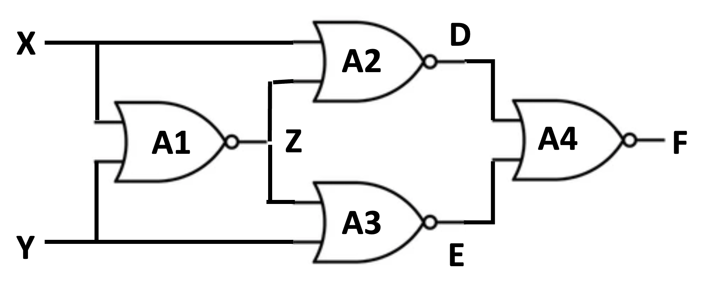

```{r setup, include=FALSE}
knitr::opts_chunk$set(echo = TRUE)
```

## R Markdown

This is an R Markdown document. Markdown is a simple formatting syntax for authoring HTML, PDF, and MS Word documents. For more details on using R Markdown see <http://rmarkdown.rstudio.com>.

# Tree Clustering

```{r}
library(graph)
library(gRbase)
library(ggm)
library(igraph)
library(RBGL)
library(sets)
```

## Directed Acyclic Graph

-   We begin by specifying the DAG for the circuit example BN.
-   To do that, we use the **ggm::DAG()** function
-   We specify the DAG as a sequence of formulas. Each formula defines a node of the graph prefixed by the tilde symbol, followed by all the node's parents separated by the plus symbol.
-   The DAG returns the adjacency matrix (AMAT) of the DAG. AMAT is an nxn matrix where n is the number of nodes.
-   The element in row i and column j in AMAT equals one if there is an edge from node i to node j and equals zero otherwise.
-   The names of the rows and columns of the adjacency matrix are the nodes of the DAG.
-   If order = TRUE, the adjacency matrix is permuted to have the nodes listed in topological order where parents precede children in the order, with the resulting adjacency matrix being upper triangular.



```{r}
G <- ggm::DAG(F ~ D+E+A4, D ~ X+Z+A2, E ~ Y+Z+A3, Z ~ X+Y+A1,order=TRUE)
print(G)
```

We use the function **ggm::plotGrap()** to plot the DAG from the adjacency matrix.

```{r}
ggm::plotGraph(G)
```

Figure shows the visualization of the DAG for the circuit BN model resulting from the execution of the `ggm::plotGraph` function. Notice there are four DAG families corresponding to the nodes "Z," "D,""E," and "F," which are the outputs of the four gates in the circuit. We use the term a DAG family to mean a child node in the DAG and all its parents.

We use the **`as()`** function to coerce the AMAT, G, to be represented as an igraph.

```{r}
dag <- as(G,"igraph")
```

We use the **igraph::V()** function to get a list of all vertices (nodes) of the dag.

```{r}
igraph::V(dag)
```

We use the **igraph::E()** function to return a list of all edges in the dag.

```{r}
igraph::E(dag)
```

### Getting DAG families- nodes and their parents

We use the **gRbase::vpardag()** function to get a list of all families in the dag, i.e., nodes and their parents in the dag. We extract the family for the node of the F variable.

```{r}
vpardag <- gRbase::vpar(dag)
vpardag$F
```

### Ancestral Sets and Ancestral Graphs

We use the gRbase::ancestralSet() function to return the ancestral set of a given set A; the ancestral set of A is the union of A with its ancestors in the dag.

```{r}
gRbase::ancestralSet(c("D","E"),dag)
```

We use the **gRbase::ancestralGraph()** function to get the ancestral graph of a given set A in the dag. The ancestral graph is the subgraph induced by the ancestral set of A in the dag.

```{r}
gRbase::ancestralGraph(c("D","E"),dag)
```

### d-separation

We use **igraph::dSep()** to determine if, in a directed acyclic graph *G*, two sets of nodes, *X* and *Y*, are d-separated by a third set *Z* of nodes. The function takes four arguments. The first argument, *G*, is a Boolean matrix representing the adjacency matrix of a directed acyclic graph. The function does not check the graph's acyclicity. In that order, the following three arguments are nodes X, Y, and Z subsets.

The code below is an example of checking that node {Y,Z} d-separates nodes E and X in the DAG of the circuit example.

(E ⟂ X \| Y, Z)

```{r}
dSep(G, "E", "X", c("Y","Z"))
```

The code below is an example of checking that node {Y,Z} d-separates nodes E and X in the DAG of the circuit example.

({A4, F} ⟂ {A2, X, A1, Y, A3} \| {D, E, Z)

```{r}
dSep(G, c("A4","F"), c("A2", "X", "A1", "Y", "A3"), c("D","E","Z"))
```

## Moralization

We use the function **gRbase::moralize()** function to create the moral graph for the DAG, *G*. The moral graph is an undirected graph where all the parents of every node of the DAG are connected.

```{r}
morG <- gRbase::moralize(G)
print(morG)
```

### Getting the Moral Graph

First, we map the moral graph adjacency matrix *morG* to an **igraph** object Second, we print the nodes and edges of the moral graph

```{r}
m_ug <- as(morG, "igraph")
print(m_ug)
```

Then, we use the function **ggm::plotGraph()** to plot the moral graph, *morG*

```{r}
ggm::plotGraph(morG)
```

### DAG Families and their Moral Subgraphs

The moral subgraphs of the DAG families form cliques or complete graphs where all nodes are connected. To demonstrate this

-   We coerce the moral graph *`morG`* to be of type igraph object named `m_ug` using the `as()` function.
-   We get the moral subgraph for subsets of nodes constituting DAG families.

The following code computes the moral subgraph, ugF, for the DAG family of the node "F" given by the list vpardag\$F. Next, we print the graph, which writes the subgraph nodes and edges.

```{r}
nodes <- vpardag$F
print(nodes)
m_ug <- as(morG, "igraph")
ugF <- subgraph(m_ug, vpardag$F)
print(ugF)
```

#### Families in the DAG are complete sets in the moral graph

Query the undirected moral graph to verify that all families in the DAG are complete sets in the moral graph. We use the function `gRbase::querygraph()` to perform the query. For details on the `querygraph()` function see the webpage at <https://www.rdocumentation.org/packages/gRbase/versions/1.3.5/topics/querygraph>

We use the function `gRbase::querygraph()` to verify that each moral subgraph is complete.

```{r}
vpardag <- gRbase::vpar(dag)
querygraph(morG, "is.complete", vpardag$Z)
querygraph(morG, "is.complete", vpardag$D)
querygraph(morG, "is.complete", vpardag$E)
querygraph(morG, "is.complete", vpardag$F)
```

### Algorithm d_separates

The following code implements the algorithm **d_separtes** To determine if, in a directed acyclic graph *G*, two sets of nodes, *X* and *Y*, are d-separated by a third set, *Z*. The algorithm checks the input sets to ensure they are mutually pairwise disjoint.

```{r}
library(igraph) # for the graph data structures
library(gRbase) # for the ancestralGraph and moralize functions

d_separates <- function(dag, X, Y, Z) {
    
  if (!is.vector(X)) { X <- c(X) }
  if (!is.vector(Y)) { Y <- c(Y) }
  if (!is.vector(Z)) { Z <- c(Z) }
  
  # Ensure X, Y, and Z are disjoint
  if (length(intersect(X, Y)) > 0 || length(intersect(Y, Z)) > 0 || length(intersect(X, Z)) > 0) {
    stop("X, Y, and Z must be disjoint sets")
  }
  
  # 1. Get the ancestral graph
  anG <- gRbase::ancestralGraph(union(X, union(Y, Z)), dag)
  ggm::plotGraph(anG)
  
  # 2. Moralize the ancestral graph
  m_anG <- gRbase::moralize(anG)
  ggm::plotGraph(m_anG)
  
  # 3. Remove all nodes in Z from m_anG 
  m2_anG <- delete_vertices(m_anG, Z)
  ggm::plotGraph(m2_anG)

  # 4. Test if X and Y are connected in m2_anG
  are_connected <- any(sapply(X, function(x) {
    # If the minimum distance from x to any node in Y is not infinity, they are connected.
    min(igraph::distances(m2_anG, v = x, to = Y)) != Inf
  }))

  return(! are_connected)
}
```

**Testcase**- checking that node {Y,Z} d-separates nodes E and X in the DAG of the circuit example.

(E ⟂ X \| Y, Z)

```{r}
d_separates(dag, "E", "X", c("Y","Z"))
```

## Maximum Cardinality Ordering

The following function takes an undirected graph and an optional first node in the ordering and returns a comple order based on the maximum cardinality heuristic which visits the vertices in such an order that every time the vertex with the most already visited neighbors is visited. Ties are broken randomly.

```{r}
max_cardinality_ordering <- function(ug, x = NULL) {
  # Ensure the graph is undirected
  if(igraph::is_directed(ug)) stop("The input graph must be undirected.")
  
  # Construct adjacency list
  adj_list <- as_adj_list(ug)

  # Number of nodes, and create an empty named vector to hold the result
  n <- vcount(ug)
  order_vec <- character(n)
  
  # Initialize node weights to 0 and set the names as node names
  weights <- rep(0, n)
  names(weights) <- names(adj_list)
  
  # If a starting node is provided, and exists in the graph
  if(!is.null(x) && x %in% names(adj_list)) {
    order_vec[1] <- x   # Set the starting node as the first node
    weights[x] <- NA   # So it won't be selected next time
  }
  
  # For each node from 2 to n
  for(i in 2:n) {
    x <- order_vec[i-1]  # The node selected in the last round
    if (!is.na(x)) weights[adj_list[[x]]] <- weights[adj_list[[x]]] + 1  # Increase the weight of its neighbors

    # From those nodes not already in the order,
    # select a node with maximum weight randomly and add it to the order
    remaining_nodes <- setdiff(names(weights), order_vec)
    max_weight_node <- remaining_nodes[which.max(weights[remaining_nodes])]
    order_vec[i] <- max_weight_node
    weights[max_weight_node] <- NA   # So it won't be selected next time
  }
  
  # Return the final dictionary as a named vector
  return(setNames(order_vec, paste0("Node_", 1:n)))
}
```

### Ordering the Moral Graph

The following generates a maximum cardinality ordering of the nodes of the moral graph that begins with the node "A1"

```{r}
ordering <- max_cardinality_ordering(m_ug,"A1")
print(ordering)
```

## Triangulation

The following function takes an undirected graph and an ordering of graph nodes as input. It outputs a triangulated graph constructed by adding fill-in edges to the input graph to make it chordal. A graph is chordal (or triangulated) if each of its cycles of four or more nodes has a chord, an edge joining two nodes that are not adjacent in the cycle. An equivalent definition is that any chordless cycle has at most three nodes.

```{r}
triangulate <- function(ug, ordering) {
  if(igraph::is_directed(ug)) stop("The graph must be undirected.") 

  ug_triangulated <- ug 
  r_ordering <- rev(ordering)

  for(i in seq_along(r_ordering)) {
    vi_name <- r_ordering[i]
    print(paste("Processing node: ", vi_name))

    if (vi_name %in% V(ug_triangulated)$name) {
      nodes_before_vi <- r_ordering[seq(i+1, length(r_ordering))]

      all_neighbors_vi <- neighbors(ug, vi_name)$name # Fetch neighbors from the original graph 'ug'
      neighbors_of_vi <- intersect(all_neighbors_vi, nodes_before_vi)

      print(paste("Neighbors of ", vi_name, " : ", paste0(neighbors_of_vi, collapse = ", ")))

      for(j in seq_along(neighbors_of_vi)) {
        for(k in seq(j+1, length(neighbors_of_vi)))  {
          nodes = c(neighbors_of_vi[j], neighbors_of_vi[k])
          nodes = nodes[order(match(nodes, r_ordering))]

          node1 <- nodes[1]
          node2 <- nodes[2]

          if(node1 %in% V(ug_triangulated)$name & node2 %in% V(ug_triangulated)$name & node1 != node2) {
            node1_vertex <- V(ug_triangulated)[node1]
            node2_vertex <- V(ug_triangulated)[node2]
            if(length(E(ug_triangulated)[node1_vertex %--% node2_vertex]) == 0) {
              print(paste("Adding edge between", node1, "and", node2))
              ug_triangulated <- igraph::add_edges(ug_triangulated, c(node1, node2))
            }
          }
        }
      }
    }
  }

  return(ug_triangulated)
}
```

### Triangulating the Moral Graph

The following code uses the **triangulate()** function on the moral graph with the maximum cardinality ordering to compute the triangulated moral graph.

```{r}
TmG <- triangulate(m_ug, ordering)
print(TmG)
```

Check that the triangulated moral graph is actually triangulated.

```{r}
gRbase::is.triangulated(TmG)
```

Verify that the triangulated graph is chordal. First, we coerce the triangulated moral graph to be of type igraph. Then, we use igraph::is_chordal() to verify the triangulated moral graph is indeed chordal.

```{r}
TG <- as(TmG, "igraph")
igraph::is_chordal(TG)
```

Plot the triangulated graph

```{r}
ggm::plotGraph(TmG)
```

### Perfect Ordering

Get a perfect ordering of the nodes of the triangulated graph using maximum cardinality search. We use the **gRbase::mcsMAT()** function which takes the adjacency matrix of an undirected graph as input and returns a perfect ordering of the nodes if it exists. The function provides a check for decomposability of the input undirected graph.

```{r}
# convert to an adjacency (association) matrix
matTG <- as_adjacency_matrix(TG, type = "both", attr = NULL, edges = FALSE, names = TRUE, sparse = FALSE)
print(matTG)
gRbase::mcsMAT(matTG)
```

### Simplicial Nodes

A node in an undirected graph is simplicial if its boundary is complete.

```{r}
gRbase::simplicialNodes(TG)
```

The following code verifies that the adjacent nodes to a simplicial node are a complete set by verifying that their subgraph in the triangulated graph is complete.

```{r}
igraph::neighbors(TG, "A1")
gRbase::is.complete(subgraph( TG, unlist(neighbors(TG, "A1"))))
```

### Maximal prime subgraph decomposition

plot the subgraph for each clique, you can extract each clique from x\$cliques, convert it to a vector using unlist(), create the subgraph with **igraph::subgraph()**, and then plot it using ggm::plotGraph().

```{r}
x <- gRbase::mpdMAT(TmG)
for(i in 1:length(x$cliques)){
  y <- unlist(x$cliques[i])
  g <- igraph::subgraph(TG, y)
  print(ggm::plotGraph(g))
}
```

## Junction Tree

To compute the junction tree that orders the maximum cliques in a tree-structured representation called a join tree, we use the **gRbase::rip()** function of the gRbase package. The function takes an adjacency matrix representation of a triangulated graph and outputs a join tree data structure. The function prints the maximum cliques and their order, the tree nodes. The RIP function designates each clique node, its parent node, and the list of separators that annotate the edges of the tree that connect the nodes and their parents.

```{r}
gRbase::rip(TmG)
```
